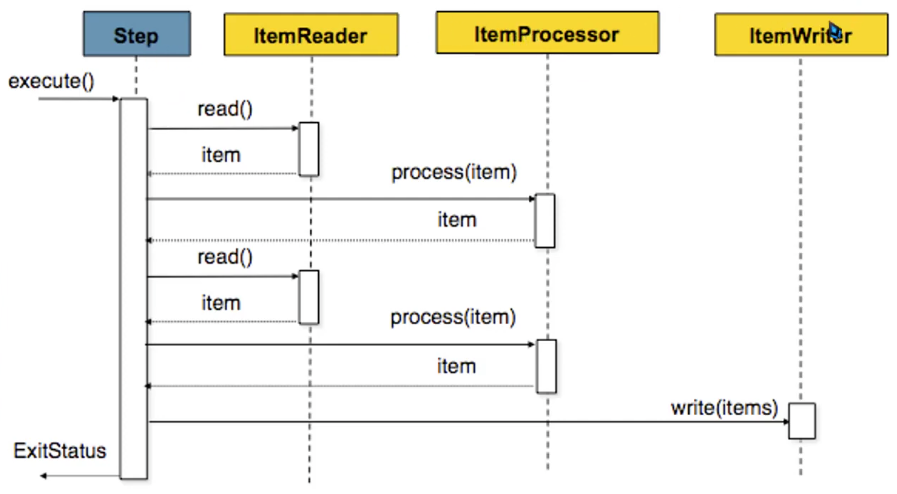

# Project using BATCH module with Chunk

## Command used to create the project from console

spring init -d=devtools,lombok,data-jpa,h2,mysql,batch --build=maven --type=maven-project --java-version=21 --group-id=com.co.manuel --artifact-id=SpringBatchChunk --description="Spring Batch application to read and write a csv file using Chunk" --name=SpringBatchChunk SpringBatchChunk

## Connection to the mysql data base in container, add to the network

Command Example: docker network connect hotel-network labs

Command Example for default user: curl -u "user" http://localhost:3000/

## Model used:

## Query for bash tasklet execution

SELECT \* FROM persons;
