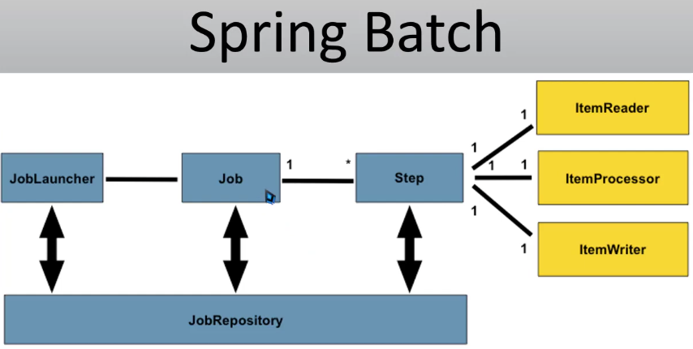

# Project using BATCH module with Tasklets

## Command used to create the project from console

spring init --boot-version=3.5.0 --build=maven --type=maven-project --group-id=com.co.manuel --artifact-id=SpringBatchTasklet --description="Spring Batch application using the tasklet approach. This app read a zip file, process and save the data in the data base" --java-version=21 --name=SpringBatchTasklet -d=devtools,lombok,web,mysql,data-jpa,batch SpringBatchTasklet

## Connection to the mysql data base in container, add to the network

Command Example: docker network connect hotel-network labs

Command Example for default user: curl -u "user" http://localhost:3000/

## Model used:

## Query for bash tasklet execution

SELECT ;
