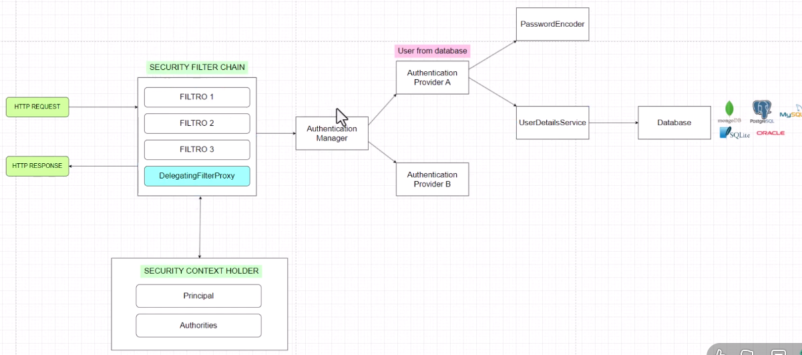

# Project using BASIC AUTHENTICATION and Spring Security module

## Command used to create the project from console

spring init -d=devtools,web,lombok,mysql,data-jpa,validation,security --type=maven-project --build=maven --java-version=21
--group-id=com.co.manuel --artifact-id=SpringSecurityApp --name=SpringSecurity --description="Using spring secuirity with mysql app" SpringSecurityApp

## Connection to the mysql data base in container, add to the network

Command Example: docker network connect hotel-network labs

Command Example for default user: curl -u "user" http://localhost:3000/auth/hello-secured

## Model used:

## Query for user, roles and permissions

SELECT u.username, r.role_enum, p.name AS permission_name FROM users u INNER JOIN user_roles ur ON u.id = ur.user_id INNER JOIN roles r ON ur.role_id = r.id INNER JOIN role_permissions rp ON r.id = rp.role_id INNER JOIN permissions p ON rp.permission_id = p.id;
